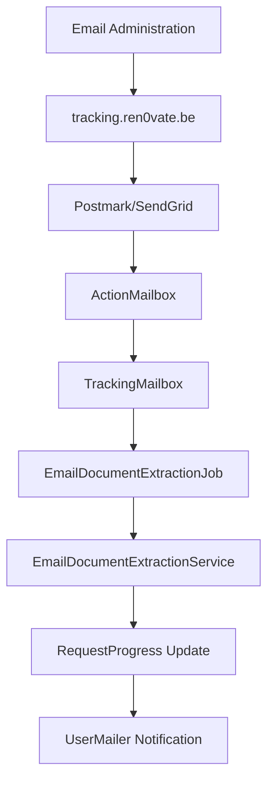

# 📧 Système de Tracking Email - Récapitulatif Complet

## 🎯 Objectif

Automatiser le suivi des demandes de primes en recevant et analysant les emails de l'administration envoyés aux adresses de tracking générées automatiquement.

## 🏗️ Architecture du Système



## ✅ Composants Implémentés

### 1. **Configuration ActionMailbox**
- ✅ ActionMailbox installé et configuré
- ✅ Tables de base de données créées
- ✅ Configuration ingress Postmark
- ✅ Routes montées (`/rails/action_mailbox`)

**Fichiers modifiés:**
- `config/application.rb` - Configuration ingress
- `config/routes.rb` - Routes ActionMailbox
- `config/environments/development.rb` - Configuration développement

### 2. **TrackingMailbox**
- ✅ Traitement automatique des emails entrants
- ✅ Extraction d'informations du sujet et corps
- ✅ Gestion des pièces jointes (PDF et images)
- ✅ Détection automatique du statut administratif
- ✅ Mise à jour du RequestProgress

**Fichier:** `app/mailboxes/tracking_mailbox.rb`

**Fonctionnalités:**
- Routage des emails vers adresses `@tracking.ren0vate.be`
- Extraction automatique des numéros de dossier
- Détection de statuts (accordé, refusé, en cours, etc.)
- Attachement automatique des documents PDF/images
- Génération de commentaires détaillés

### 3. **Service d'Extraction de Documents**
- ✅ Extraction de texte des PDF (pdf-reader + poppler)
- ✅ OCR pour les images (Tesseract)
- ✅ Analyse intelligente du contenu
- ✅ Extraction de données structurées

**Fichier:** `app/services/email_document_extraction_service.rb`

**Capacités d'extraction:**
- Numéros de dossier administratif
- Montants accordés (en €)
- Dates de décision
- Statuts administratifs
- Conditions spéciales

### 4. **Job Asynchrone d'Extraction**
- ✅ Traitement en arrière-plan
- ✅ Gestion d'erreurs robuste
- ✅ Tracking des statuts d'extraction
- ✅ Mise à jour automatique des RequestProgress

**Fichier:** `app/jobs/email_document_extraction_job.rb`

**États de traitement:**
- `pending` - En attente
- `processing` - En cours
- `completed` - Terminé avec succès
- `failed` - Échec avec message d'erreur

### 5. **Modèle RequestProgress Enrichi**
- ✅ Nouveaux champs de tracking
- ✅ Méthodes d'aide pour les données extraites
- ✅ Enum pour statuts d'extraction

**Nouveaux champs ajoutés:**
- `extracted_data` (TEXT) - Données JSON extraites
- `email_processed_at` (DATETIME) - Timestamp traitement
- `document_extraction_status` (STRING) - Statut extraction

**Fichier:** `app/models/request_progress.rb`

### 6. **Système de Notifications**
- ✅ Templates email HTML/texte
- ✅ Notification automatique des utilisateurs
- ✅ Emails multilingues
- ✅ Informations détaillées sur les mises à jour

**Fichiers:**
- `app/mailers/user_mailer.rb` - Logique d'envoi
- `app/views/user_mailer/tracking_email_received.html.erb` - Template HTML
- `app/views/user_mailer/tracking_email_received.text.erb` - Template texte

### 7. **Configuration de Routage**
- ✅ ApplicationMailbox configuré
- ✅ Routage par pattern email
- ✅ Gestion des emails non reconnus

**Fichier:** `app/mailboxes/application_mailbox.rb`

Pattern de routage: `/@tracking\.ren0vate\.be$/i`

## 📋 Migration de Base de Données

**Migration appliquée:** `20250924065207_add_email_tracking_fields_to_request_progresses.rb`

```sql
-- Nouveaux champs ajoutés
ALTER TABLE request_progresses ADD COLUMN extracted_data TEXT;
ALTER TABLE request_progresses ADD COLUMN email_processed_at DATETIME;
ALTER TABLE request_progresses ADD COLUMN document_extraction_status STRING DEFAULT 'pending';

-- Index pour performance
CREATE INDEX index_request_progresses_on_document_extraction_status;
CREATE INDEX index_request_progresses_on_email_processed_at;
```

## 🔧 Outils de Test et Débogage

### Script de Test Complet
**Fichier:** `scripts/test_email_tracking.rb`

**Fonctionnalités:**
- Création automatique de données de test
- Simulation d'emails entrants
- Vérification du traitement
- Rapport de statut détaillé

**Utilisation:**
```bash
cd /path/to/ren0vate
ruby scripts/test_email_tracking.rb
```

### Tests Manuel en Console
```ruby
# Créer un RequestProgress de test
rp = RequestProgress.first

# Simuler un email
receive_inbound_email_from_mail do
  to rp.email_suivi
  from "admin@bruxelles.be"
  subject "Votre demande - Dossier BXL-2024-1234"
  body "Votre demande a été acceptée. Montant accordé: 2500€"
end
```

## 📚 Documentation Complète

**Fichier:** `Documents_strategiques/EMAIL_TRACKING_SETUP_GUIDE.md`

**Contenu:**
- Configuration DNS et webhooks
- Installation des dépendances
- Configuration production
- Guide de débogage
- Métriques et monitoring

## 🚀 Flux de Fonctionnement

### 1. **Génération de l'Adresse**
Lors de la création d'un `RequestProgress` :
```ruby
# Format: {region}-{property_id}-{project_id}-{timestamp}@tracking.ren0vate.be
"bruxelles-75-general-1758550029@tracking.ren0vate.be"
```

### 2. **Réception d'Email**
1. Email envoyé à l'adresse de tracking
2. Postmark/SendGrid reçoit l'email
3. Webhook vers ActionMailbox
4. Routage vers TrackingMailbox

### 3. **Traitement Automatique**
1. Identification du RequestProgress
2. Extraction des informations de base
3. Traitement des pièces jointes (si présentes)
4. Mise à jour du statut et commentaires
5. Programmation de l'extraction de documents

### 4. **Extraction de Documents** (Asynchrone)
1. Téléchargement temporaire du fichier
2. Extraction de texte (PDF-reader ou Tesseract)
3. Analyse et extraction de données structurées
4. Mise à jour du RequestProgress
5. Marquage comme terminé ou échec

### 5. **Notification Utilisateur**
1. Email automatique à l'utilisateur
2. Résumé des nouvelles informations
3. Liens vers les détails complets
4. Template adapté à la langue de l'utilisateur

## 🔍 Points de Monitoring

### Métriques Importantes
- Taux de succès de traitement des emails
- Temps de traitement moyen
- Taux d'extraction de données réussie
- Volume d'emails par jour/semaine

### Commandes de Vérification
```ruby
# Emails récents
ActionMailbox::InboundEmail.last(10).pluck(:id, :status, :created_at)

# Extractions en échec
RequestProgress.extraction_failed.count

# Emails non traités
ActionMailbox::InboundEmail.pending.count
```

### Logs à Surveiller
- ❌ Adresses de tracking non reconnues
- 🔍 Échecs d'extraction de documents
- 📧 Volume d'emails entrants anormal

## 🛠️ Configuration Production

### Variables d'Environnement Requises
```bash
POSTMARK_INBOUND_WEBHOOK_SECRET=your_webhook_secret
ACTION_MAILBOX_INGRESS=postmark
TESSERACT_PATH=/usr/bin/tesseract  # optionnel
PDF_READER_ENABLED=true            # optionnel
```

### Configuration DNS
```bash
# Enregistrements DNS requis
MX    tracking.ren0vate.be    10 inbound.postmarkapp.com
TXT   tracking.ren0vate.be    "v=spf1 include:spf.mtasv.net ~all"
```

### Dépendances Système
```bash
# Ubuntu/Debian
sudo apt-get install poppler-utils tesseract-ocr tesseract-ocr-fra

# macOS
brew install poppler tesseract tesseract-lang
```

### Gems Requises
```ruby
# Gemfile
gem 'pdf-reader'        # Pour extraction PDF
gem 'rtesseract'        # Pour OCR (optionnel)
```

## ✅ État Actuel du Projet

**Statut:** ✅ **COMPLET ET PRÊT POUR LES TESTS**

### Ce qui fonctionne :
- ✅ Réception et routage des emails
- ✅ Traitement automatique des contenus
- ✅ Extraction de documents (PDF/images)
- ✅ Mise à jour des RequestProgress
- ✅ Notifications utilisateur
- ✅ Gestion d'erreurs robuste
- ✅ Outils de test et monitoring

### Prochaines étapes (semaine prochaine) :
- 🧪 Tests complets avec données réelles
- 🔧 Ajustements basés sur les retours
- 🚀 Configuration production
- 📊 Mise en place du monitoring

## 📞 Support Technique

Pour toute question ou problème :
1. Consulter le guide de configuration complet
2. Utiliser le script de test inclus
3. Vérifier les logs avec les emojis de débogage
4. Consulter la documentation ActionMailbox officielle

---

**Date de création :** 24 septembre 2025
**Version :** 1.0
**Système :** Ren0vate - Tracking automatique des demandes de primes
