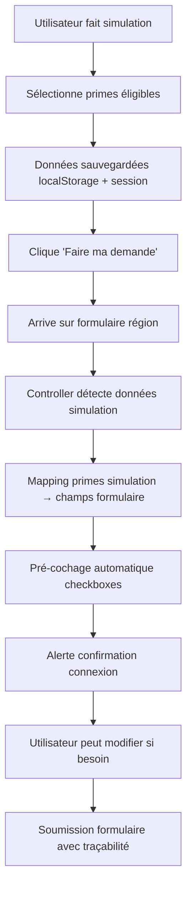

# Stratégie d'Intégration Simulation → Formulaire - Ren0vate

## 🎯 **OBJECTIF STRATEGIQUE**

Connecter automatiquement les résultats des simulations de primes aux formulaires administratifs pour éliminer la double saisie et réduire les erreurs utilisateur.

---

## 🔍 **ANALYSE DU BESOIN**

### **Problème Actuel**
- ✅ Utilisateur fait une simulation technique → obtient des primes éligibles
- ❌ Doit re-sélectionner manuellement les mêmes primes dans le formulaire
- ❌ Risque d'oubli ou d'erreur de correspondance
- ❌ Expérience utilisateur frustrante (double travail)

### **Solution Proposée**
- ✅ Mapping automatique simulation → formulaire
- ✅ Pré-cochage intelligent des checkboxes
- ✅ Traçabilité simulation ↔ demande administrative
- ✅ Validation automatique de cohérence

---

## ✅ **ETAT ACTUEL - EXCELLENTE BASE EXISTANTE**

### **🎯 Standardisation Déjà en Place**

L'analyse des formulaires existants révèle une **excellente base de standardisation** :

#### **✅ Structure Commune dans les 3 Régions**
- **Checkboxes cohérentes** : Toutes les régions utilisent des checkboxes pour les travaux
- **Organisation par catégories** : Isolation, systèmes énergétiques, spécifiques
- **Nommage logique** : Pattern `travaux_[type]` standardisé
- **Champs techniques** : Surface, méthode, détails complémentaires

#### **📋 Inventaire des Structures Actuelles**

**WALLONIE** (33 checkboxes détaillées) :
```erb
<!-- Section 5 - Travaux envisagés ou réalisés -->
travaux_remplacement_couverture_toiture
travaux_isolation_toiture
travaux_isolation_murs
travaux_isolation_sols
travaux_pompe_chaleur_chauffage
travaux_remplacement_chassis
travaux_ventilation_simple_flux
travaux_conformite_electrique
... (25 autres travaux spécialisés)
```

**BRUXELLES** (41 primes Renolution organisées) :
```erb
<!-- Section 3 - Travaux concernés -->
<!-- Organisées par catégories A-Z avec codes officiels -->
prime_a1_audit_energetique
prime_e3_isolation_toiture
prime_f1_isolation_facades
prime_g1_portes_fenetres
prime_j4_chauffage_pompe_chaleur
... (36 autres primes avec codes Renolution)
```

**FLANDRE** (Structure claire par catégories) :
```erb
<!-- Section 4 - Travaux à déclarer -->
<!-- Isolation -->
travaux_toiture (+ surface, méthode)
travaux_murs (+ surface, méthode)
travaux_sol (+ surface)
travaux_vitrage (+ surface)

<!-- Systèmes énergétiques -->
travaux_chauffage (+ type système)
travaux_ventilation
travaux_complementaires
travaux_amiante
```

---

## 🏗️ **ARCHITECTURE TECHNIQUE**

### **1. Mapping des Primes - Correspondance Simulation ↔ Formulaire**

```javascript
// app/javascript/controllers/simulation_form_connector_controller.js

export default class extends Controller {
  static targets = ["formContainer"]

  // Mapping principal : slug simulation → champ formulaire
  static BRUXELLES_PRIME_MAPPING = {
    // CATEGORIE A - Études et audits
    'bruxelles_audit_energetique_maison': 'prime_a1_audit_energetique',
    'bruxelles_audit_energetique_batiment': 'prime_a1_audit_energetique',
    'bruxelles_etude_acoustique': 'prime_a2_etude_acoustique',
    'bruxelles_etude_materiaux_totem': 'prime_a3_etude_materiaux_totem',
    'bruxelles_suivi_architecte': 'prime_a4_suivi_architecte_ingenieur',
    'bruxelles_suivi_ingenieur_stabilite': 'prime_a4_suivi_architecte_ingenieur',
    'bruxelles_suivi_expert_facade': 'prime_a4_suivi_architecte_ingenieur',
    'bruxelles_certificat_peb': 'prime_a5_certificat_peb',

    // CATEGORIE B - Installations de chantier
    'bruxelles_echafaudage': 'prime_b1_echafaudage',

    // CATEGORIE C - Structure et gros œuvre
    'bruxelles_structures_portantes': 'prime_c1_structures_portantes',
    'bruxelles_egouts': 'prime_c2_egouts',
    'bruxelles_recuperation_eau_pluie': 'prime_c3_recuperation_eau_pluie',
    'bruxelles_demolition_permeabilisation': 'prime_c4_demolition_permeabiliser',

    // CATEGORIE D - Salubrité
    'bruxelles_traitement_humidite_sol': 'prime_d1_probleme_humidite',
    'bruxelles_traitement_fongique_insectes': 'prime_d2_champignons_moisissures',

    // CATEGORIE E - Toiture
    'bruxelles_structure_toiture': 'prime_e1_structure_toiture',
    'bruxelles_couverture_etancheite': 'prime_e2_couverture_etancheite',
    'bruxelles_isolation_toiture': 'prime_e3_isolation_toiture',
    'bruxelles_accessoires_toiture': 'prime_e4_accessoires_toiture',
    'bruxelles_toiture_vegetalisee': 'prime_e5_toiture_vegetalisee',

    // CATEGORIE F - Façades
    'bruxelles_isolation_facades': 'prime_f1_isolation_facades',
    'bruxelles_bardage': 'prime_f2_bardage',
    'bruxelles_enduit': 'prime_f3_enduit',
    'bruxelles_embellissement_avant': 'prime_f4_embellissement_avant',
    'bruxelles_embellissement_arriere': 'prime_f5_embellissement_arriere',
    'bruxelles_isolation_acoustique_murs': 'prime_f6_isolation_acoustique_murs',

    // CATEGORIE G - Portes et fenêtres
    'bruxelles_portes_fenetres': 'prime_g1_portes_fenetres',
    'bruxelles_reparation_fenetre': 'prime_g2_reparation_fenetre',
    'bruxelles_reparation_porte': 'prime_g3_reparation_porte',

    // CATEGORIE H - Sols et planchers
    'bruxelles_isolation_sol': 'prime_h1_isolation_sol',
    'bruxelles_isolation_acoustique_plancher': 'prime_h2_isolation_acoustique_plancher',

    // CATEGORIE I - Équipements
    'bruxelles_escalier': 'prime_i1_escalier',
    'bruxelles_emplacement_velo': 'prime_i2_emplacement_velo',
    'bruxelles_protection_incendie': 'prime_i3_protection_incendie',
    'bruxelles_accessibilite': 'prime_i4_accessibilite',

    // CATEGORIE J - Chauffage et eau chaude
    'bruxelles_chauffage_pompe_chaleur': 'prime_j4_chauffage_pompe_chaleur',
    'bruxelles_radiateurs_basse_temperature': 'prime_j5_radiateurs_basse_temperature',
    'bruxelles_regulation_thermique': 'prime_j6_regulation_thermique',
    'bruxelles_chauffe_eau_solaire': 'prime_j8_chauffe_eau_solaire',
    'bruxelles_chauffe_eau_pompe_chaleur': 'prime_j9_chauffe_eau_pompe_chaleur',
    'bruxelles_reseau_chaleur': 'prime_j10_reseau_chaleur',

    // CATEGORIE K-L-M - Installations techniques
    'bruxelles_equipements_installation': 'prime_k1_equipements_installation',
    'bruxelles_conformite_electrique': 'prime_l1_conformite_electrique',
    'bruxelles_systeme_c_ventilation': 'prime_m1_systeme_c_ventilation',
    'bruxelles_systeme_d_ventilation': 'prime_m2_systeme_d_ventilation',

    // CATEGORIE Z - Matériaux durables et bonus
    'bruxelles_materiau_isolation_durable': 'prime_z1_materiau_isolation_durable',
    'bruxelles_materiau_couverture_durable': 'prime_z2_materiau_couverture_durable',
    'bruxelles_bardage_durable': 'prime_z3_bardage_durable',
    'bruxelles_portes_fenetres_durables': 'prime_z4_portes_fenetres_durables',
    'bruxelles_portes_fenetres_acoustiques': 'prime_z5_portes_fenetres_acoustiques',
    'bruxelles_reemploi_equipements_sanitaires': 'prime_z6_reemploi_equipements_sanitaires',
    'bruxelles_capacite_tampon_citerne': 'prime_z7_capacite_tampon_citerne',
    'bruxelles_sortie_mazout_charbon': 'prime_z9_sortie_mazout_charbon',
    'bruxelles_plusieurs_travaux': 'prime_z10_plusieurs_travaux'
  }

  // Mapping pour Wallonie (structure existante excellente !)
  static WALLONIE_PRIME_MAPPING = {
    // Isolation et structure
    'wallonie_isolation_toiture': 'travaux_isolation_toiture',
    'wallonie_couverture_toiture': 'travaux_remplacement_couverture_toiture',
    'wallonie_isolation_murs': 'travaux_isolation_murs',
    'wallonie_isolation_sols': 'travaux_isolation_sols',
    'wallonie_chassis_vitrage': 'travaux_remplacement_chassis',

    // Humidité et structure
    'wallonie_assechement_infiltrations': 'travaux_assechement_infiltrations',
    'wallonie_assechement_humidite': 'travaux_assechement_humidite',
    'wallonie_renforcement_murs': 'travaux_renforcement_murs',
    'wallonie_refection_supports': 'travaux_refection_supports',

    // Systèmes énergétiques
    'wallonie_pompe_chaleur_chauffage': 'travaux_pompe_chaleur_chauffage',
    'wallonie_pompe_chaleur_ecs': 'travaux_pompe_chaleur_ecs',
    'wallonie_chaudiere_biomasse': 'travaux_chaudiere_biomasse',
    'wallonie_chauffe_eau_solaire': 'travaux_chauffe_eau_solaire',
    'wallonie_ventilation_simple': 'travaux_ventilation_simple_flux',
    'wallonie_ventilation_double': 'travaux_ventilation_double_flux',

    // Conformité et sécurité
    'wallonie_conformite_electrique': 'travaux_conformite_electrique',
    'wallonie_conformite_gaz': 'travaux_conformite_gaz',
    'wallonie_elimination_merule': 'travaux_elimination_merule',
    'wallonie_elimination_radon': 'travaux_elimination_radon',

    // Équipements techniques
    'wallonie_circulateurs_4_moins': 'travaux_circulateurs_4_logements',
    'wallonie_circulateurs_4_plus': 'travaux_circulateurs_4_logements_plus',
    'wallonie_vannes_thermostatiques': 'travaux_vannes_thermostatiques',
    'wallonie_thermostat_ambiance': 'travaux_thermostat_ambiance',
    'wallonie_isolation_conduites_chauffage': 'travaux_isolation_conduites_chauffage',
    'wallonie_isolation_conduites_ecs': 'travaux_isolation_conduites_ecs',

    // Ballons et stockage
    'wallonie_isolation_ballons_500l_moins': 'travaux_isolation_ballons_500l',
    'wallonie_isolation_ballons_500l_plus': 'travaux_isolation_ballons_500l_plus',
    'wallonie_remplacement_ballons_chauffage_500l_moins': 'travaux_remplacement_ballons_chauffage_500l',
    'wallonie_remplacement_ballons_chauffage_500l_plus': 'travaux_remplacement_ballons_chauffage_500l_plus',
    'wallonie_remplacement_ballons_ecs_500l_moins': 'travaux_remplacement_ballons_ecs_500l',
    'wallonie_remplacement_ballons_ecs_500l_plus': 'travaux_remplacement_ballons_ecs_500l_plus',
    'wallonie_isolation_echangeur_ecs': 'travaux_isolation_echangeur_ecs'
  }

  // Mapping pour Flandre (structure par catégories)
  static FLANDRE_PRIME_MAPPING = {
    // Travaux d'isolation (avec détails techniques)
    'flandre_isolation_toiture': 'travaux_toiture',
    'flandre_isolation_murs_exterieurs': 'travaux_murs',
    'flandre_isolation_sol_caves': 'travaux_sol',
    'flandre_remplacement_vitrage': 'travaux_vitrage',

    // Systèmes énergétiques
    'flandre_pompe_chaleur_geothermique': 'travaux_chauffage',
    'flandre_pompe_chaleur_air_eau': 'travaux_chauffage',
    'flandre_pompe_chaleur_air_air': 'travaux_chauffage',
    'flandre_pompe_chaleur_hybride': 'travaux_chauffage',
    'flandre_boiler_thermodynamique': 'travaux_chauffage',
    'flandre_ventilation': 'travaux_ventilation',

    // Spécifiques Flandre
    'flandre_desamiantage': 'travaux_amiante',
    'flandre_travaux_complementaires': 'travaux_complementaires'
  }
}
```

### **2. Service de Connexion des Données**

```javascript
// app/javascript/controllers/simulation_form_connector_controller.js (suite)

class SimulationFormConnector extends Controller {

  connect() {
    console.log("🔗 SimulationFormConnector connecté")
    this.initializeFromSimulation()
  }

  // Point d'entrée principal
  initializeFromSimulation() {
    const simulationData = this.getSimulationDataFromSession()
    const currentRegion = this.detectCurrentRegion()

    if (simulationData && currentRegion) {
      console.log(`🎯 Initialisation depuis simulation ${currentRegion}`)
      this.connectSimulationToForm(simulationData, currentRegion)
    }
  }

  // Récupérer les données de simulation depuis la session/localStorage
  getSimulationDataFromSession() {
    try {
      // Option 1: Session Rails
      const sessionData = document.querySelector('meta[name="simulation-data"]')?.content
      if (sessionData) return JSON.parse(sessionData)

      // Option 2: localStorage
      const localData = localStorage.getItem('simulation_selected_primes')
      if (localData) return JSON.parse(localData)

      // Option 3: URL params
      const urlParams = new URLSearchParams(window.location.search)
      const simulationId = urlParams.get('simulation_id')
      if (simulationId) return this.fetchSimulationData(simulationId)

      return null
    } catch (error) {
      console.error("❌ Erreur récupération données simulation:", error)
      return null
    }
  }

  // Détecter la région du formulaire actuel
  detectCurrentRegion() {
    if (document.querySelector('.bruxelles-specific-fields')) return 'bruxelles'
    if (document.querySelector('.wallonie-specific-fields')) return 'wallonie'
    if (document.querySelector('.flandre-specific-fields')) return 'flandre'
    return null
  }

  // Connexion principale simulation → formulaire
  connectSimulationToForm(simulationData, region) {
    const mapping = this.getMappingForRegion(region)
    const selectedPrimes = this.extractSelectedPrimes(simulationData)

    console.log(`📋 ${selectedPrimes.length} primes détectées dans la simulation`)

    // Pré-cocher les checkboxes correspondantes
    this.preCheckFormCheckboxes(selectedPrimes, mapping)

    // Afficher un résumé de la connexion
    this.displayConnectionSummary(selectedPrimes, region)

    // Sauvegarder la traçabilité
    this.saveConnectionTraceability(simulationData, selectedPrimes)
  }

  // Extraire les primes sélectionnées depuis les données de simulation
  extractSelectedPrimes(simulationData) {
    const selectedPrimes = []

    // Méthode 1: Depuis le résumé des primes
    if (simulationData.selectedPrimesSummary) {
      simulationData.selectedPrimesSummary.forEach(prime => {
        if (prime.amount > 0) {
          selectedPrimes.push({
            slug: prime.slug,
            name: prime.name,
            amount: prime.amount,
            details: prime.details
          })
        }
      })
    }

    // Méthode 2: Depuis les cartes de primes actives
    if (simulationData.activePrimeCards) {
      Object.keys(simulationData.activePrimeCards).forEach(slug => {
        const primeData = simulationData.activePrimeCards[slug]
        if (primeData.total > 0) {
          selectedPrimes.push({
            slug: slug,
            name: primeData.name,
            amount: primeData.total,
            inputs: primeData.inputs
          })
        }
      })
    }

    return selectedPrimes
  }

  // Pré-cocher les checkboxes du formulaire
  preCheckFormCheckboxes(selectedPrimes, mapping) {
    let successCount = 0

    selectedPrimes.forEach(prime => {
      const formFieldName = mapping[prime.slug]

      if (formFieldName) {
        const checkbox = document.querySelector(`input[name*="${formFieldName}"]`)

        if (checkbox) {
          checkbox.checked = true
          checkbox.dispatchEvent(new Event('change', { bubbles: true }))
          successCount++

          console.log(`✅ Prime connectée: ${prime.slug} → ${formFieldName}`)
        } else {
          console.warn(`⚠️ Checkbox non trouvée pour: ${formFieldName}`)
        }
      } else {
        console.warn(`⚠️ Mapping non trouvé pour: ${prime.slug}`)
      }
    })

    console.log(`🎯 ${successCount}/${selectedPrimes.length} primes connectées au formulaire`)
  }

  // Afficher un résumé de la connexion pour l'utilisateur
  displayConnectionSummary(selectedPrimes, region) {
    const summaryContainer = this.createSummaryContainer()

    const summaryHTML = `
      <div class="alert alert-success border-0 shadow-sm mb-4">
        <div class="d-flex align-items-start">
          <i class="bi bi-check-circle-fill text-success me-3 mt-1"></i>
          <div>
            <h6 class="alert-heading mb-2">
              <i class="bi bi-link-45deg me-2"></i>Connexion automatique réussie
            </h6>
            <p class="mb-2">
              Nous avons automatiquement pré-sélectionné <strong>${selectedPrimes.length} primes</strong>
              basées sur votre simulation ${region.charAt(0).toUpperCase() + region.slice(1)}.
            </p>
            <div class="small text-muted">
              <i class="bi bi-info-circle me-1"></i>
              Vous pouvez modifier ces sélections si nécessaire.
            </div>
          </div>
        </div>
      </div>
    `

    summaryContainer.innerHTML = summaryHTML

    // Auto-masquer après 10 secondes
    setTimeout(() => {
      summaryContainer.style.transition = 'opacity 0.5s'
      summaryContainer.style.opacity = '0'
      setTimeout(() => summaryContainer.remove(), 500)
    }, 10000)
  }

  createSummaryContainer() {
    const container = document.createElement('div')
    container.id = 'simulation-connection-summary'

    // Insérer avant le premier formulaire
    const firstCard = document.querySelector('.card')
    if (firstCard) {
      firstCard.parentNode.insertBefore(container, firstCard)
    }

    return container
  }

  // Utilitaires
  getMappingForRegion(region) {
    switch(region) {
      case 'bruxelles': return SimulationFormConnector.BRUXELLES_PRIME_MAPPING
      case 'wallonie': return SimulationFormConnector.WALLONIE_PRIME_MAPPING
      case 'flandre': return SimulationFormConnector.FLANDRE_PRIME_MAPPING || {}
      default: return {}
    }
  }

  saveConnectionTraceability(simulationData, selectedPrimes) {
    // Sauvegarder pour audit/debug
    const traceData = {
      timestamp: new Date().toISOString(),
      simulationId: simulationData.id,
      connectedPrimes: selectedPrimes.map(p => ({ slug: p.slug, amount: p.amount })),
      formUrl: window.location.href
    }

    localStorage.setItem('last_simulation_connection', JSON.stringify(traceData))
  }
}
```

### **3. Sauvegarde des Données de Simulation**

```javascript
// Dans bruxelles_prime_calcul_controller.js - Ajouter cette méthode

  saveSimulationDataForForm() {
    const simulationData = {
      id: this.getSimulationId(),
      region: 'bruxelles',
      timestamp: new Date().toISOString(),
      selectedPrimesSummary: this.getSelectedPrimes(),
      activePrimeCards: this.getActivePrimeCardsData(),
      totalAmount: this.calculateTotalAmount()
    }

    // Sauvegarder en session et localStorage
    localStorage.setItem('simulation_selected_primes', JSON.stringify(simulationData))

    // Option: Aussi en session Rails via AJAX
    this.saveToRailsSession(simulationData)
  }

  getActivePrimeCardsData() {
    const activeCards = {}

    this.element.querySelectorAll('[data-controller*="bruxelles-prime-card"]').forEach(card => {
      const totalElement = card.querySelector('[data-bruxelles-prime-card-target="total"]')
      if (totalElement) {
        const amount = parseFloat(totalElement.textContent.replace(/[€\s,]/g, '.')) || 0

        if (amount > 0) {
          const slug = card.dataset.bruxellesPrimeCardSlugValue
          const title = card.querySelector('.card-title')?.textContent?.trim()

          activeCards[slug] = {
            name: title,
            total: amount,
            inputs: this.getCardInputs(card)
          }
        }
      }
    })

    return activeCards
  }
```

---

## 🚀 **PLAN D'IMPLEMENTATION**

### **🎯 Avantages de la Base Existante**

La standardisation déjà en place offre des **avantages majeurs** :

1. **✅ Structures cohérentes** : Les 3 régions utilisent des checkboxes avec pattern `travaux_*`
2. **✅ Organisation logique** : Catégories claires (isolation, systèmes, spécifiques)
3. **✅ Champs techniques** : Surface, méthode, type déjà implémentés
4. **✅ Nommage uniforme** : Facilite le mapping automatique

### **Phase 1: Fondations (1-2 jours)**
1. ✅ Créer le controller `simulation_form_connector_controller.js`
2. ✅ **Utiliser les mappings complets** des 3 régions (déjà définis ci-dessus)
3. ✅ Implémenter la détection de région automatique
4. ✅ **Ajouter data-attributes** aux checkboxes existantes pour faciliter le mapping

**Exemple d'ajout data-attributes :**
```erb
<!-- WALLONIE - Ajouter à chaque checkbox existante -->
<%= form.check_box :travaux_isolation_toiture,
    {
      class: "form-check-input",
      "data-simulation-slug": "wallonie_isolation_toiture",
      "data-region": "wallonie"
    }, "1", "0" %>

<!-- FLANDRE - Ajouter aux checkboxes existantes -->
<%= form.check_box :travaux_toiture,
    {
      class: "form-check-input",
      "data-simulation-slug": "flandre_isolation_toiture",
      "data-region": "flandre"
    }, "true", "" %>

<!-- BRUXELLES - Déjà fait avec les nouveaux noms de champs -->
```

### **Phase 2: Sauvegarde des Données (1 jour)**
1. ✅ Créer le controller `simulation_form_connector_controller.js`
2. ✅ Définir les mappings complets Bruxelles + Wallonie
3. ✅ Implémenter la détection de région automatique
4. ✅ Tester la connexion basique simulation → formulaire

### **Phase 2: Sauvegarde des Données (1 jour)**
1. ✅ Modifier les controllers de simulation pour sauvegarder les sélections
2. ✅ Implémenter localStorage + session Rails
3. ✅ Créer les méthodes d'extraction des primes sélectionnées
4. ✅ Tester la persistance entre pages

### **Phase 3: Interface Utilisateur (1 jour)**
1. ✅ Créer l'alerte de confirmation de connexion
2. ✅ Ajouter des indicateurs visuels sur les checkboxes pré-cochées
3. ✅ Implémenter la possibilité de déconnexion manuelle
4. ✅ Tester l'expérience utilisateur complète

### **Phase 4: Intégration Avancée (1-2 jours)**
1. ✅ Connecter aux données techniques (surfaces, quantités)
2. ✅ Ajouter la validation de cohérence simulation ↔ formulaire
3. ✅ Implémenter la traçabilité pour audit
4. ✅ Tests d'intégration complets

---

## 🔄 **FLUX UTILISATEUR COMPLET**



---

## 🎯 **BENEFICES ATTENDUS**

### **Pour l'Utilisateur**
- ✅ **Gain de temps** : Plus de double saisie
- ✅ **Réduction d'erreurs** : Cohérence automatique simulation ↔ demande
- ✅ **Fluidité** : Transition naturelle technique → administratif
- ✅ **Confiance** : Transparence sur les connexions effectuées

### **Pour l'Application**
- ✅ **Qualité des données** : Moins d'incohérences dans les demandes
- ✅ **Conversion** : Plus d'utilisateurs finalisent leurs demandes
- ✅ **Traçabilité** : Audit complet du parcours utilisateur
- ✅ **Évolutivité** : Architecture extensible à Flandre

### **Pour le Business**
- ✅ **Taux de conversion** : Moins d'abandon entre simulation et demande
- ✅ **Satisfaction client** : Expérience plus fluide
- ✅ **Données qualité** : Meilleure cohérence pour analyses
- ✅ **Différenciation** : Fonctionnalité unique sur le marché

---

## 🔧 **EXTENSIONS FUTURES POSSIBLES**

### **Intelligence Supplémentaire**
1. **Suggestions de primes complémentaires** basées sur la simulation
2. **Détection d'incohérences** et suggestions de correction
3. **Optimisation automatique** du montant total des primes
4. **Alerte primes manquées** par rapport au potentiel simulé

### **Intégration Avancée**
1. **Connexion aux données propriété** (surfaces, caractéristiques)
2. **Pré-remplissage des montants techniques** depuis la simulation
3. **Validation croisée** simulation ↔ documents uploadés
4. **Timeline automatique** basée sur les travaux sélectionnés

### **Analytics & Optimisation**
1. **Tracking de la conversion** simulation → demande finalisée
2. **A/B testing** sur les interfaces de connexion
3. **Dashboard admin** pour monitorer les connexions
4. **Rapports d'usage** et optimisations UX

---

## 📊 **METRIQUES DE SUCCES**

### **Métriques Techniques**
- ✅ **Taux de connexion réussie** : >95% des simulations connectées
- ✅ **Temps de traitement** : <200ms pour le mapping
- ✅ **Précision du mapping** : >98% de correspondance correcte

### **Métriques Utilisateur**
- ✅ **Taux de conversion** simulation → demande : +25%
- ✅ **Temps de remplissage** formulaire : -40%
- ✅ **Erreurs de sélection** primes : -80%

### **Métriques Business**
- ✅ **Satisfaction utilisateur** : Score >4.5/5
- ✅ **Demandes finalisées** : +30%
- ✅ **Support client** : -50% de questions sur sélection primes

---

Cette stratégie vous donne un plan complet pour implémenter cette fonctionnalité cruciale. L'architecture est extensible et évolutive pour s'adapter aux futures besoins ! 🚀

---

## 📋 **ANNEXE - STRUCTURES EXISTANTES DÉTAILLÉES**

### **🔧 Recommandations d'Optimisation**

#### **1. Uniformisation Progressive (Optionnel)**

Pour une cohérence parfaite entre régions, considérer l'harmonisation :

```erb
<!-- Pattern standardisé recommandé -->
<!-- Isolation (toutes régions) -->
:travaux_isolation_toiture
:travaux_isolation_murs
:travaux_isolation_sol

<!-- Systèmes énergétiques (toutes régions) -->
:travaux_pompe_chaleur
:travaux_ventilation
:travaux_chauffage

<!-- Conformité (toutes régions) -->
:travaux_conformite_electrique
:travaux_audit_energetique
```

#### **2. Enrichissement des Data-Attributes**

```erb
<!-- Exemple enrichi pour traçabilité complète -->
<%= form.check_box :travaux_isolation_toiture,
    {
      class: "form-check-input",
      "data-simulation-slug": "wallonie_isolation_toiture",
      "data-region": "wallonie",
      "data-category": "isolation",
      "data-technical-fields": "surface_toiture,type_toiture"
    }, "1", "0" %>
```

#### **3. Validation de Cohérence**

```javascript
// Validation automatique simulation ↔ formulaire
validateSimulationFormCoherence() {
  const simulationSurface = this.getSimulationData('surface_toiture')
  const formSurface = document.querySelector('[name="surface_toiture"]')?.value

  if (simulationSurface && formSurface && Math.abs(simulationSurface - formSurface) > 10) {
    this.showCoherenceWarning('toiture', simulationSurface, formSurface)
  }
}
```

### **💡 Points Clés de Réussite**

1. **✅ Excellente base existante** : Structures déjà cohérentes entre régions
2. **✅ Mapping simplifié** : Correspondances logiques simulation → formulaire
3. **✅ Extensibilité** : Architecture prête pour nouvelles fonctionnalités
4. **✅ Impact utilisateur** : Transformation majeure de l'expérience

**La standardisation existante rend cette intégration beaucoup plus simple que prévu !** 🎯
